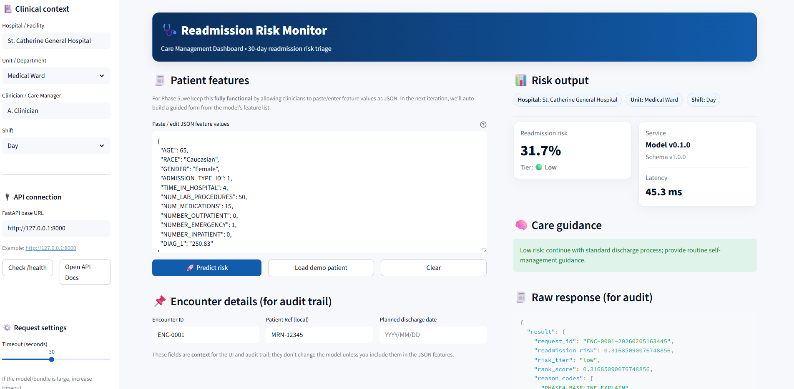

🏥 Readmission Risk Monitor

Production-grade ML system for 30-day hospital readmission risk triage

📌 Overview

Readmission Risk Monitor is an end-to-end machine learning system designed to support clinical care management teams by predicting a patient’s 30-day hospital readmission risk at the point of discharge.

The system combines:

Leakage-safe ML training and evaluation

A production-ready FastAPI inference service

Monitoring and observability (latency + Prometheus metrics)

A clinician-friendly Streamlit dashboard that mirrors real hospital workflows

This project is intentionally built to production engineering standards, suitable for regulated healthcare environments and ML engineering portfolios.

_________________________________________________________________________________________________________________________________________________________________

🎯 Business Problem

Hospital readmissions are:

Costly

Operationally disruptive

Often preventable with early intervention

Clinical teams need a transparent, fast, and auditable way to:

Identify high-risk patients

Prioritise care-management resources

Support safe discharge decisions

This system addresses that need through risk scoring + triage guidance.

_________________________________________________________________________________________________________________________________________________________________
🧠 ML Use Case

Task: Binary classification

Target: 30-day readmission (Yes / No)

Output:

Readmission probability

Risk tier (Low / Medium / High)

Latency + audit metadata
_________________________________________________________________________________________________________________________________________________________________

🚀 Phases Delivered
✅ Phase 1 — Foundations

Repo scaffolding

Configuration management

Data contracts & schemas

✅ Phase 2 — Feature Engineering

Leakage-safe feature design

Consistent training/serving schema

✅ Phase 3 — Model Training & Evaluation

Baseline → LightGBM

Offline evaluation artifacts

Model + metadata bundling

✅ Phase 4 — Production Inference API

FastAPI service

/predict, /health, /metrics

Latency tracking

Prometheus metrics

Strict request/response schemas

✅ Phase 5 — Clinical Streamlit Dashboard

A fully functional clinician-facing UI that demonstrates how the model would be used in practice.

_________________________________________________________________________________________________________________________________________________________________

🖥️ Streamlit Clinical Dashboard (Phase 5)

The Streamlit app simulates a real hospital care-management workflow.

Key UI Sections

Clinical Context

Hospital / Facility

Unit / Department

Clinician / Care Manager

Shift (Day / Night)

Patient Features

JSON-based feature input (Phase 5 design choice)

Demo patient loader

Clear / reset controls

Risk Output Panel

Readmission risk (%)

Risk tier (Low / Medium / High)

Model version

Schema version

Inference latency

Care Guidance

Tier-specific guidance for discharge planning

Audit & Governance

Encounter metadata

Raw model response (for audit trails)

📊 Monitoring & Observability

Request count

Inference latency histogram

Prometheus-compatible /metrics endpoint

Health checks via /health

Designed to plug into:

Grafana

Cloud monitoring stacks

ML observability tools

_________________________________________________________________________________________________________________________________________________________________
🔮 Next Steps (Phase 6+)

These are explicitly documented to show senior-level thinking:

Phase 6 — Explainability

SHAP values

Feature-level contribution

Clinician-friendly explanations

Phase 7 — Deployment Hardening

Dockerfile + Docker Compose

Environment separation

Model version pinning

Phase 8 — CI/CD & Governance

GitHub Actions

Automated tests

Schema drift checks

Model promotion workflow

Phase 9 — Enterprise Integration

EHR/FHIR adapters

Event-driven ingestion

Secure authentication

👩‍⚕️ Why This Project Stands Out

It demonstrates:

Systems thinking over models

Healthcare-appropriate design

Auditability & observability

Realistic UI for non-technical users

Clear production roadmap

👤 Author

Esther Uzor
AI / ML Engineer 
London, UK

